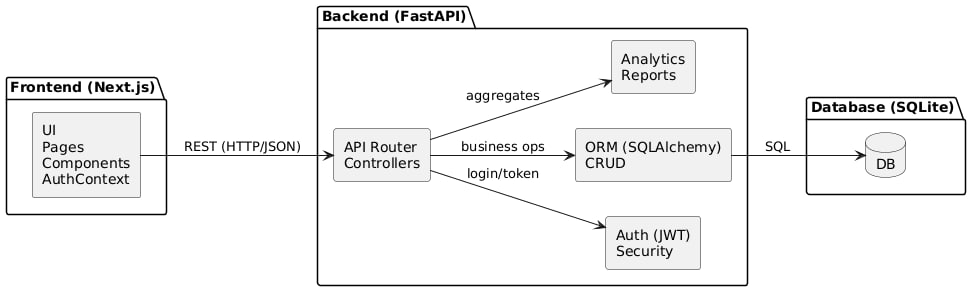
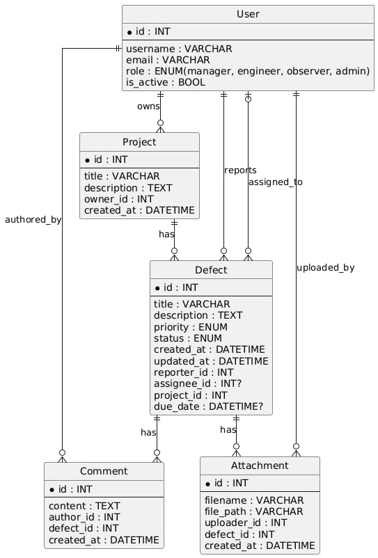
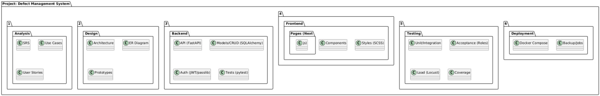

Конечно — ниже приведена **упрощённая, структурированная и оформленная в Markdown** версия текста, готовая для размещения в GitHub README или документации.

---

# 📘 Документация проекта

## 1. Анализ

### 1.1. Цели разработки

Цель — создание монолитного веб-приложения для централизованного управления дефектами на строительных объектах.
Система должна обеспечивать полный жизненный цикл дефекта: регистрация → обработка → контроль → аналитика.
Основные задачи:

* снижение потерь информации;
* повышение прозрачности работ;
* единая точка взаимодействия участников проекта.

---

### 1.2. Пользовательские роли

* **Менеджер** — создаёт проекты, назначает исполнителей, управляет дефектами, формирует отчёты.
* **Инженер** — регистрирует дефекты, обновляет статусы, добавляет вложения и комментарии.
* **Наблюдатель** — просматривает проекты, дефекты и аналитику.
* **Администратор** — управляет пользователями и системными процессами.

---

### 1.3. Функциональные требования

* Авторизация/аутентификация (JWT)
* Регистрация пользователей
* Работа с проектами (CRUD)
* Работа с дефектами:

  * создание/редактирование
  * назначение исполнителей
  * статусы: *Новая → В работе → На проверке → Закрыта/Отменена*
  * история изменений
  * фильтрация и поиск
* Комментарии и вложения
* Аналитические отчёты и экспорт CSV/Excel

---

### 1.4. Нефункциональные требования

* Время отклика ≤ **1 сек** при 50 активных пользователях
* Русский язык интерфейса
* Адаптивная верстка
* Хранение паролей **bcrypt/argon2**
* Защита от XSS, CSRF, SQL-инъекций
* Ежедневные резервные копии БД
* Поддержка Chrome, Firefox, Edge

---

### 1.5. Предметная область

Система решает проблему отсутствия централизованного учёта дефектов и недостаточной прозрачности коммуникаций при строительстве.

---

### 1.6. Use Case анализ

В документе представлены все ключевые сценарии: регистрация, вход, работа с проектами и дефектами, аналитика.


---

### 1.7. Итоги этапа анализа

* Сформированы FR и NFR
* Подготовлены Use Case диаграммы
* Созданы User Stories
* Готовое SRS

---

## 2. Проектирование

### 2.1. Архитектура

Монолитное веб-приложение:



* **Frontend:** Next.js + SCSS
* **Backend:** FastAPI + SQLAlchemy
* **Database:** SQLite

---

### 2.2. Логическая архитектура Backend


* `models.py` — ORM модели
* `schemas.py` — Pydantic-схемы
* `crud.py` — доступ к данным
* `main.py` — маршруты, JWT, middleware
* `backup_db.py` — резервное копирование

---

### 2.3. Логическая архитектура Frontend

* `app/` — страницы
* `components/`
* `context/` — AuthContext
* `api/` — клиент API

---

### 2.4. ER-диаграмма



Сущности:

* User
* Project
* Defect
* Comment
* Attachment

---

### 2.5. Прототипы интерфейсов

Страницы:

* авторизация
* dashboard
* проекты
* карточка проекта
* дефекты
* аналитика

---

### 2.6. Декомпозиция (WBS)

Основные модули:



* Users/Auth
* Projects
* Defects
* Comments
* Attachments
* Reports
* Тестирование
* Документация

---

### 2.7. Итоги проектирования

* Архитектура
* ER-диаграмма
* Описание слоёв
* Прототипы
* Полная структура проекта

---

## 3. Разработка

### 3.1. Общий подход

Реализованы модули Users, Projects, Defects, Comments, Attachments, Reports.
Проект разделён на frontend и backend.

---

### 3.2. Backend (FastAPI)

**main.py:** маршруты, JWT, CORS
**models.py:** ORM-модели
**crud.py:** CRUD
**schemas.py:** валидация Pydantic
**backup_db.py:** резервное копирование

---

### 3.3. Frontend (Next.js)

Страницы:

* `/login`, `/register`, `/projects`, `/defects`, главная и др.

Компоненты:

* формы
* карточки
* таблицы

Контекст:

* хранение JWT
* защита маршрутов

API-клиент:

* GET/POST/PUT/DELETE

---

### 3.4. Реализация модулей

**Users/Auth:** регистрация, JWT, роли
**Projects:** CRUD, привязка дефектов
**Defects:** статусы, фильтрация, поиск, история
**Comments:** добавление/редактирование
**Attachments:** загрузка, удаление, просмотр
**Reports:** статистика + экспорт CSV/Excel

---

### 3.5. Репозиторий

Содержит:

* backend
* frontend
* документацию

---

### 3.6. Соответствие ТЗ

Выполнены:

* рабочий прототип
* Users, Projects, Defects, Reports
* вложения
* фильтрация
* документация
* unit/integration tests

---

## 4. Безопасность

### 4.1. Хранение паролей

Используется **bcrypt (passlib)**.

### 4.2. Авторизация

* JWT
* проверка ролей
* защита эндпоинтов

### 4.3. Защита от уязвимостей

* SQLAlchemy предотвращает SQL-инъекции
* экранирование данных
* статeless-архитектура без необходимости CSRF

### 4.4. Логирование

* middleware FastAPI
* файл логов с ограниченным доступом

### 4.5. Защита логов

* ролевой доступ
* ротация
* ограничение прав на чтение

### 4.6. Резервное копирование

Скрипт `backup_db.py` создаёт ежедневные копии.

---

## 5. Тестирование

### 5.1. План тестирования

Включает:

* модульное
* интеграционное
* тестирование User Stories
* нагрузочное
* регрессионное

---

### 5.2. Unit tests

≥ 5 тестов:

* CRUD Projects
* CRUD Defects
* регистрация
* JWT вход
* Pydantic схемы

### 5.3. Интеграционные тесты

≥ 2 сценария:

* регистрация → вход → защищённые запросы
* проект → дефект → обновление статуса

### 5.4. User Stories

Проверяются реальные рабочие сценарии.

### 5.5. Нагрузочное тестирование

Подтверждено время отклика ≤ 1 сек при 50 пользователях.

### 5.6. Покрытие кода

Используется `coverage.py`.

### 5.7. Итоги тестирования

Все требования ТЗ выполнены.

---

## 6. Введение в эксплуатацию

### 6.1. Подготовка окружения

**Backend:**

```bash
python -m venv venv
pip install -r requirements.txt
uvicorn backend.main:app --reload
```

**Frontend:**

```bash
npm install
npm run dev
```

**Docker:**

```bash
docker-compose up --build -d
```

---

### 6.2. Развёртывание на сервере

Поддерживаются:

* Linux
* Windows Server
* Docker

---

### 6.3. Резервное копирование

* `backup_db.py`
* PowerShell-скрипт для планировщика задач

---

Если нужно — могу:
✔ сделать из этого полноценный `README.md`
✔ добавить оглавление
✔ оформить как документацию `/docs`
✔ добавить UML-диаграммы в Markdown

Готов продолжать!
