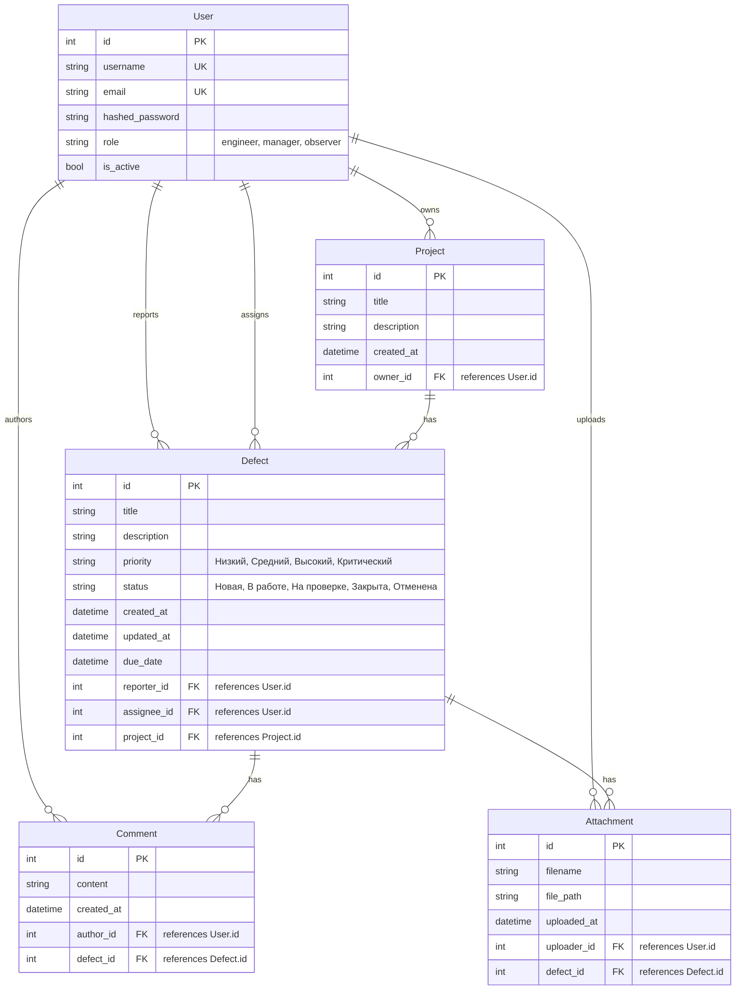

# ER-диаграмма базы данных

Ниже представлена ER-диаграмма (Entity-Relationship Diagram), описывающая структуру базы данных системы управления дефектами. Диаграмма показывает сущности (таблицы), их атрибуты и взаимосвязи.

